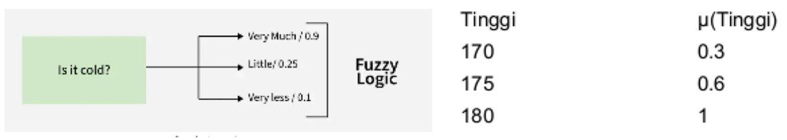
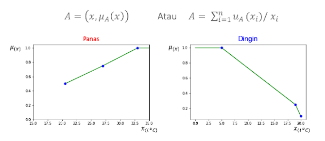
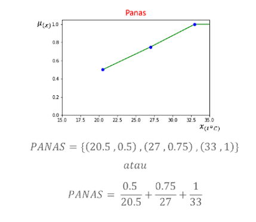

### 1. Fuzzy Logic

Fuzzy Logic berfungsi untuk mendefinisikan suatu ketidakpastian menjadi hal yang terukur secara matematis (contohnya rentang batas antara "tinggi" dan "pendek").
* **Fungsi:** Menangani ketidakpastian (*uncertainty*) dan keaburan data.
* **Karakteristik Utama:** Menggunakan **derajat keanggotaan** (*degree of membership*) dengan nilai rentang antara 0 hingga 1.
* **Penerapan:** Sangat umum digunakan pada sistem kontrol (contoh: pengatur suhu AC, mesin cuci otomatis).

#### Mengapa Fuzzy Dibutuhkan?
Dalam kehidupan nyata, banyak keputusan yang tidak bersifat tegas:
* "Cuaca agak panas"
* "Mahasiswa Cukup Pintar"
* "Pendapatan rendah"
Logika klasik (crisp) tidak mampu menangani ambiguitas tersebut.

#### Himpunan Crisp / Logika Klasik
HImpunan crisp adalah himpunan derajat keanggotaan 
hanya: 
$\mu_A(x) = 0 \text{ atau } 1$

Contoh:
$A = {x >= 180}$

#### Himpunan Fuzzy
* Definisi
HImpunan Fuzzy memiliki derajat keanggotaan antara 0 dan 1.
$\mu_A(x): X \to [0, 1]$

Elemen-elemen dalam himpunan fuzzy tidak hanya memiliki
dua kemungkinan saja, yaitu anggota suatu himpunan atau bukan anggota suatu himpunan, Akan tetapi setiap elemen himpunan fuzzy memiliki nilai derajat keanggotaan (membership degree)

#### Himpunan Fuzzy - Membership Degree

Notasi Keanggotaan Himpunan Fuzzy:

#### Himpunan Fuzzy - Membership Function

Membership function atau fungsi keanggotan yang dibuat harus sesuai dengan permasalahan yang ada.

Misalkan terdapat himpunan A, yaitu suatu himpunan yang anggota-anggotanya adalah bilangan-bilangan yang dekat dengan nol.

Membership function Himpunan A : 

#### Logika Fuzzy
Atur

#### Aturan Fuzzy
